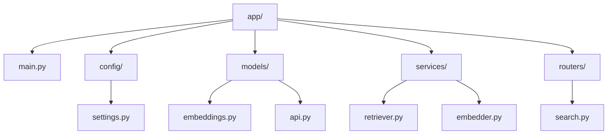
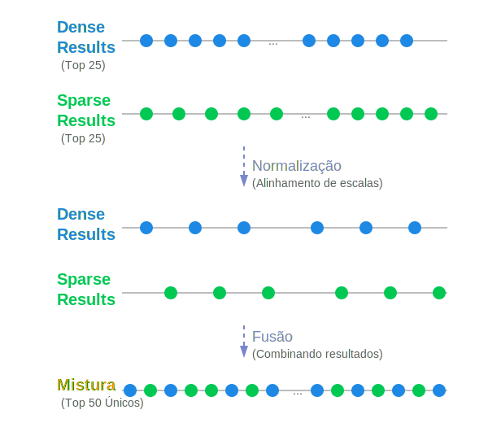
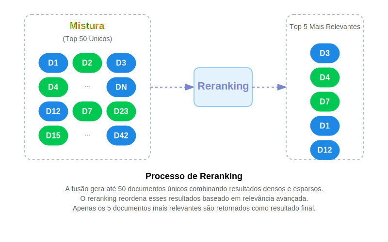

# RAG API - Plataforma de Busca com Hybrid Search

## Sobre o Projeto

Esta API implementa uma plataforma de RAG utilizando técnicas de busca vetorial híbrida via Qdrant. A aplicação combina busca densa (embeddings semânticos), busca esparsa (BM25) e interação tardia ([late interaction ColBERT](https://jina.ai/news/what-is-colbert-and-late-interaction-and-why-they-matter-in-search/)) para oferecer resultados de alta relevância.

## Características

- **Busca Híbrida**: Combina três métodos de busca vetorial:
  - Embeddings densos para capturar semântica
  - Vetores esparsos (BM25) para relevância baseada em palavras-chave
  - Interação tardia (ColBERT) para reordenação precisa
- **API REST**: Interface simples e documentada via FastAPI
- **Configuração Flexível**: Facilmente configurável via variáveis de ambiente
- **Tratamento de Erros**: Respostas de erro descritivas e logging para debugging

## Requisitos

- Python 3.13+
- Qdrant (local ou na nuvem)
- Pacotes Python listados em `requirements.txt`

## Instalação

1. Clone o repositório:
   ```bash
   git clone https://github.com/infoslack/mentoria-ia-2025.git
   cd mentoria-ia-2025
   ```

2. Crie e ative um ambiente virtual:
   ```bash
   python -m venv .venv
   # No Windows
   .venv\Scripts\activate
   # No Linux/MacOS
   source .venv/bin/activate
   ```
3. Ou com UV:
    ```bash
    uv venv .venv --python=3.13.2
    uv pip install pip
    ```

4. Instale as dependências:
   ```bash
   uv pip install -r requirements.txt
   ```

5. Configure as variáveis de ambiente:
   ```bash
   cp .env.example .env
   # Edite o arquivo .env com suas configurações
   ```

## Configuração

Edite o arquivo `.env` com suas configurações:

```
# Configuração do Qdrant
QDRANT_URL=http://localhost:6333
QDRANT_API_KEY=sua_chave_api_se_necessario
COLLECTION_NAME=nome_da_sua_colecao
```

## Executando a API

```bash
uvicorn app.main:app --reload
```

A API estará disponível em `http://localhost:8000`

## Endpoints

### GET /

Retorna informações básicas sobre a API.

### GET /health

Verifica o status de saúde da API e a configuração atual.

### POST /search

Realiza uma busca usando a técnica de busca híbrida.

**Exemplo de requisição:**

```json
{
  "query": "sua consulta aqui",
  "limit": 5
}
```

**Exemplo de resposta:**

```json
{
  "results": [
    {
      "page_content": "conteúdo do documento encontrado",
      "metadata": {}
    }
  ]
}
```

## Documentação da API

A documentação interativa da API está disponível em:

- Swagger UI: http://localhost:8000/docs
- ReDoc: http://localhost:8000/redoc

## Estrutura do Projeto

```
app/
├── main.py              # Aplicação FastAPI principal
├── config/
│   └── settings.py      # Configurações
├── models/
│   ├── embeddings.py    # Modelos Pydantic para embeddings
│   └── api.py           # Modelos de requisição/resposta da API
├── services/
│   ├── retriever.py     # QdrantRetriever para busca
│   └── embedder.py      # QueryEmbedder para geração de embeddings
└── routers/
    └── search.py        # Endpoints de busca
```



## Como Funciona

1. O usuário envia uma consulta para o endpoint `/search`
2. A consulta é transformada em três tipos de embeddings:
   - Vetor denso para capturar semântica
   - Vetor esparso (BM25) para relevância de palavras-chave
   - Vetor de interação tardia para comparação token a token
3. Qdrant executa uma busca em duas etapas:
   - Primeiro recupera candidatos usando busca densa e esparsa
   - Depois reordena os resultados usando o modelo de interação tardia
4. Os documentos mais relevantes são retornados ao usuário



