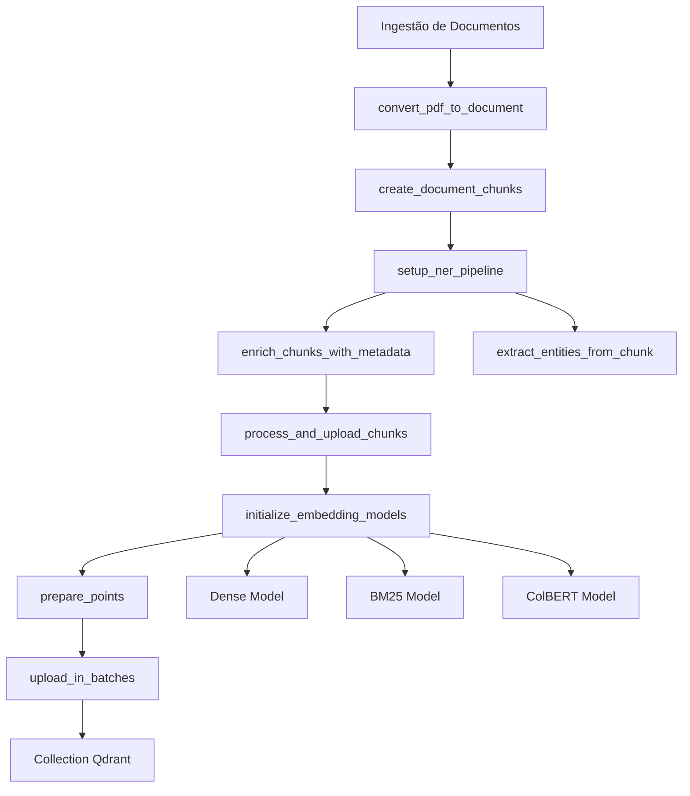

# Processamento e ingestão de dados

O sistema é composto por dois scripts principais:

- Script de criação da `collection` que configura uma collection no Qdrant com suporte para busca híbrida (três tipos de embeddings).
- Script de ingestão que processa arquivos PDF, divide em chunks, extrai entidades nomeadas, cria embeddings e envia para o Qdrant.

### Criação da Collection
O script `create-collection.py` configura uma collection no Qdrant otimizada para busca híbrida com três tipos de vetores:

- Vetor denso: Para busca semântica (768 dimensões, distância de cosseno)
- Vetor esparso: Para busca baseada em palavras-chave (BM25)
- Vetor de interação tardia: Para busca avançada tipo ColBERT v2.0

Como usar:
```bash
python create-collection.py
```

PS: O script verifica se a collection já existe e a remove se necessário, em seguida cria uma nova collection com as configurações adequadas.

### Processamento e Ingestão
O script `ingestion.py` processa documentos PDF e os envia para o Qdrant, executando:

- Conversão do PDF para um formato estruturado
- Divisão do documento em chunks gerenciáveis (usando Docling)
- Extração de entidades nomeadas (nomes, organizações, etc.)
- Criação de três tipos de embeddings para cada chunk
- Envio dos dados para o Qdrant

Como usar:
```bash
python ingest.py
```
Obs:

> - O caminho do arquivo PDF pode ser ajustado na variável PDF_PATH
> - O modelo NER pode ser alterado de acordo com suas necessidades
> - O tamanho do lote (batch_size) para upload pode ser ajustado conforme necessário



### Configurações Personalizáveis

- `MAX_TOKENS`: Tamanho máximo dos chunks (padrão: 750)
- `MIN_ENTITY_CONFIDENCE`: Limiar de confiança para extração de entidades (padrão: 0.80)
- Modelos de embedding: Podem ser alterados conforme necessário